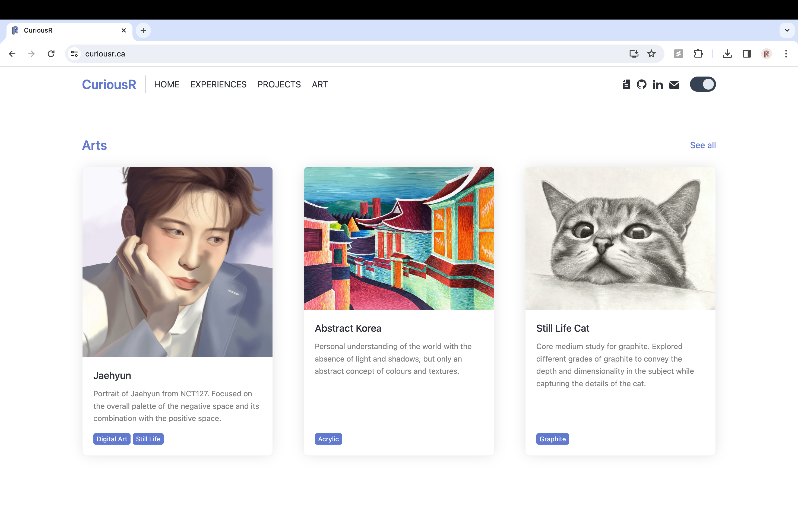
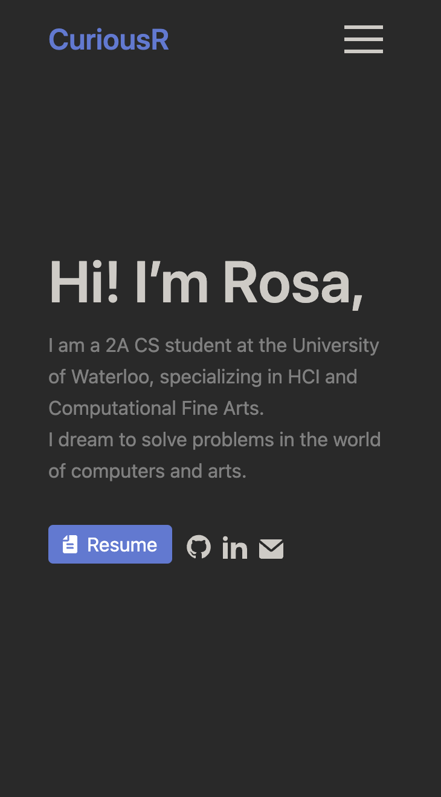
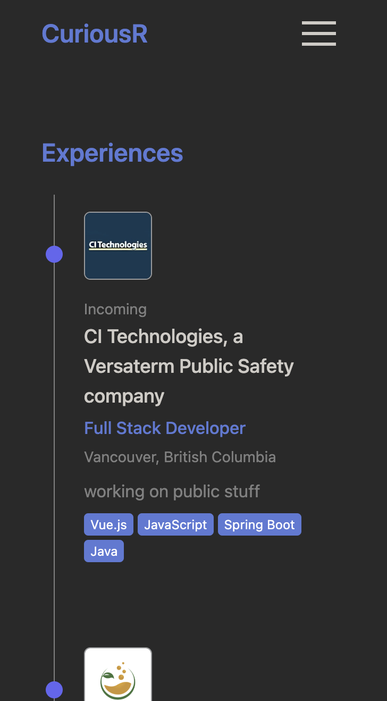
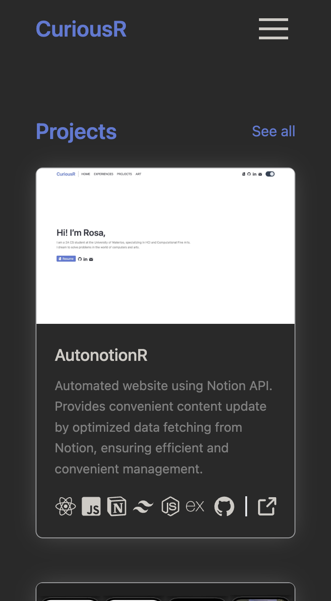
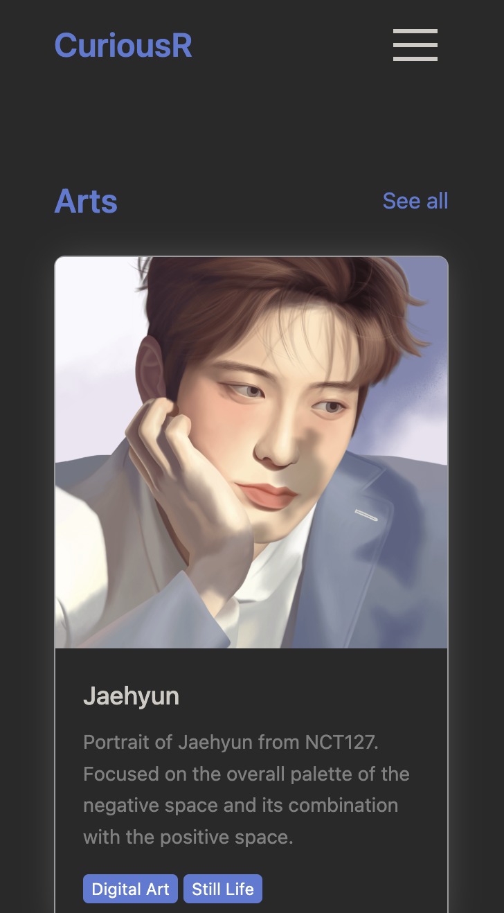

# AutonotionR

AutonotionR is an open-source project that allows users to create an automated website with Notion workspace integration.

This project allows users to update their website just by updating their Notion, offering a convienient automatic content update on any of your devices. 

## Preview
This is the website preview

    

        

            
            
        

        

            
            
        

    

    

        
        
        
        
    

## Documentation
to be added

