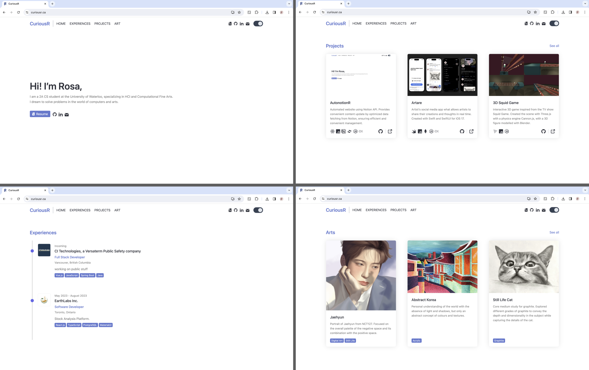
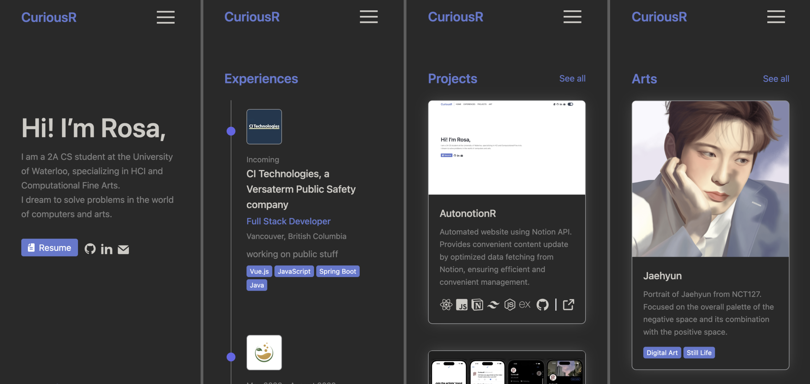
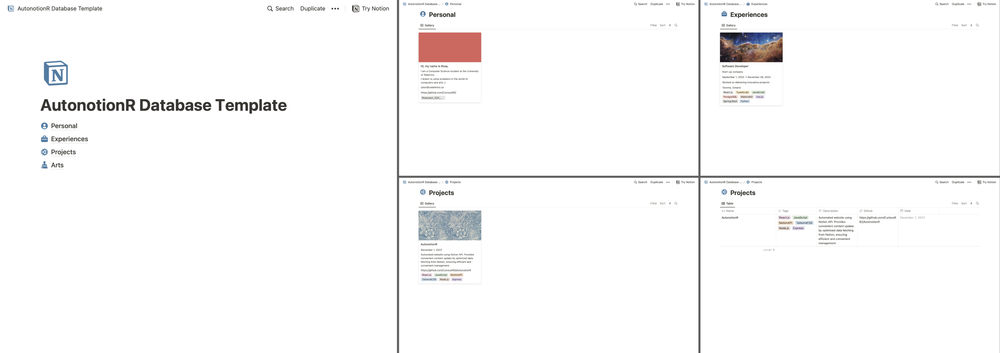

<div align="left">
    <a src="https://www.curiousr.ca/"></a>
    <h1>AutonotionR</h1>
    
    
    
    
    
    
    
    </br></br>
</div>

AutonotionR simplifies website management by seamlessly integrating with **Notion workspaces**. This **open-source** project enables users to effortlessly update their websites simply by making changes in Notion.

Enjoy the convenience of **automatic content updates**, ensuring your website stays current **across all your devices**. AutonotionR streamlines the process, making web management a breeze without unnecessary complexities.

Discover a straightforward and efficient way to keep your website content up-to-date with AutonotionR.

## Preview
 



# Documentation

## Table of Contents
- [Documentation](#documentation)
  - [Table of Contents](#table-of-contents)
  - [Introduction ](#introduction-)
  - [Project Initialization / Forking the Repository ](#project-initialization--forking-the-repository-)
    - [Installing Dependencies ](#installing-dependencies-)
    - [Connecting the Database ](#connecting-the-database-)
    - [Running the Project ](#running-the-project-)
  - [Database Setup ](#database-setup-)
    - [Database Template ](#database-template-)
    - [Filling in Database Key and IDs ](#filling-in-database-key-and-ids-)
  - [Code Structure ](#code-structure-)
    - [Data Fetching in `index.js` ](#data-fetching-in-indexjs-)
    - [App Structure in `App.jsx` ](#app-structure-in-appjsx-)
    - [Customizing Logo ](#customizing-logo-)
  - [Notion Database Cautions ](#notion-database-cautions-)
  - [Common Errors and Solutions ](#common-errors-and-solutions-)
    - ["Cannot find 'properties'" Error ](#cannot-find-properties-error-)

## Introduction <a name="introduction"></a>

AutonotionR is an open-source project that enables users to create automated websites seamlessly integrated with Notion workspaces. This documentation provides a step-by-step guide to set up and customize AutonotionR for your needs.

## Project Initialization / Forking the Repository <a name="project-initialization"></a>
To initialize the project, begin by forking the AutonotionR repository to your account. Please fork the repository by clicking on the `Fork` button at the top of this repository home, and clone the fork of your repository (`<repo-name>`) with `git clone https://github.com/<your-username>/<repo-name>.git`.

### Installing Dependencies <a name="installing-dependencies"></a>

Run `npm install` in **two** directories; `<repo-name>/frontend` and `<repo-name>/server` to install the required dependencies for both of the sub sirectories.

### Connecting the Database <a name="connecting-the-database"></a>

Follow the instructions in the [Database Setup](#database-setup) section to connect AutonotionR to your Notion workspace.

### Running the Project <a name="running-the-project"></a>

Execute `nodemon index.js` in the `<repo-name>/server` directory to start the server for the backend.
Execute `npm start` in the `<repo-name>/frontend` directory to start the server for the frontend.

## Database Setup <a name="database-setup"></a>

### Database Template <a name="database-template"></a>

To get started, use the provided [Database Template](https://shocking-evening-5f4.notion.site/AutonotionR-Database-Template-9aaeb395dcc8414b9993b55c5183f3e5) 📄 to structure your Notion workspace. This template includes essential fields required for integration.



### Filling in Database Key and IDs <a name="filling-in-database-key-ids"></a>

In your project, create a `.env` file inside the `AutonotionR/server` directory with your Notion integration credentials and database key IDs. Refer to the [Build your first integration](https://developers.notion.com/docs/create-a-notion-integration) page by Notion for detailed instructions.
For your reference, the API key in the project is named `REACT_APP_NOTION_API_KEY`, and the database IDs are named `REACT_APP_<database name>_DATABASE_ID`.


## Code Structure <a name="code-structure"></a>

### Data Fetching in `index.js` <a name="data-fetching-in-indexjs"></a>

Examine the data fetching structure in the `index.js` file to understand how AutonotionR retrieves and updates content from your Notion workspace.
```javascript
// Fetching data from Notion using the Notion Client SDK
const notion = new Client({
    // your API KEY from Notion
    auth: process.env.REACT_APP_NOTION_API_KEY,
});

// ...

// Fetching PROJECT data
app.get('/project-data', async (req, res) => {
    res.set('Access-Control-Allow-Origin', '*');
    try {
        const response = await notion.databases.query({
            // Your DATABASE ID goes here
            database_id: process.env.REACT_APP_PROJECTS_DATABASE_ID,
            // This SORTS the way your data is retrieved 
            sorts: [
                {
                    property: 'Date',
                    direction: 'descending',
                },
            ],
        });
        res.json(response);
    } catch (error) {
        res.status(500).json({ error: error.message });
    }
});
```
For more information on sorting the data, please read [this page](https://developers.notion.com/reference/post-database-query-sort#:~:text=A%20sort%20is%20a%20condition,in%20ascending%20(i.e.%20direction)) from the Notion Developers Doc.

### App Structure in `App.jsx` <a name="app-structure-in-appjsx"></a>

Explore the `<repo-name>/frontend/src/App.jsx` file to comprehend the overall structure of your AutonotionR application. Customize it according to your design preferences.

This is the general structure:
```javascript
// imports
function App() {
    // scroll settings 
    ...
    // light/dark mode management 
    ...

    // Fetch data here from the server of this link
    // Later, change this to your own vercel server link.
    // const APILink = process.env.REACT_APP_VERCEL_SERVER_LINK;
    const APILink = "http://localhost:4000";

    // Data fetching from the backend server (Project data is getting fetched here)
    const [projectData, setProjectData] = useState([]);
    const [projectLoading, setProjectLoading] = useState(true);
    useEffect(() => {
        const fetchData = async () => { ... };
        fetchData();
    }, []);

    // Fetching other data
    ...
    // checking for loading completion on console 
    ...

    return (
        <>
            {(!projectLoading) && (
                <div> 
                    {/* Router configuration */}
                </div>
            )}
        </>
    );
}

export default App;
```

### Customizing Logo <a name="customizing-logo"></a>

Modify `logoUtils.jsx` in the components folder and add your desired logos to the logos folder to personalize the appearance of your AutonotionR website.

`logoUtils.jsx` structure:
```javascript
import { ReactComponent as TailwindLight } from "../logos/tailwind-light.svg";
import { ReactComponent as TailwindDark } from "../logos/tailwind-dark.svg";
...

function strToLogo(str, isLight) {
    if (isLight) {
        switch (str) {
            case "TailwindCSS":
                return <TailwindLight className={"w-[26px] h-[26px]"} />
            ...
            default:
                return <></>
        }
    } else {
        switch (str) {
            case "TailwindCSS":
                return <TailwindDark className={"w-[26px] h-[26px]"} />
            ...
            default:
                return <></>
        }
    }
}

export default strToLogo;
```

## Notion Database Cautions <a name="notion-database-cautions"></a>

Be cautious when modifying your Notion database. Ensure that all necessary fields are populated to prevent errors in data retrieval.

## Common Errors and Solutions <a name="common-errors-and-solutions"></a>

### "Cannot find 'properties'" Error <a name="cannot-find-properties-error"></a>

If you encounter the `Cannot find 'properties'` error, check your Notion database to ensure that all cells have been filled with data. This error typically occurs when required properties are missing.
